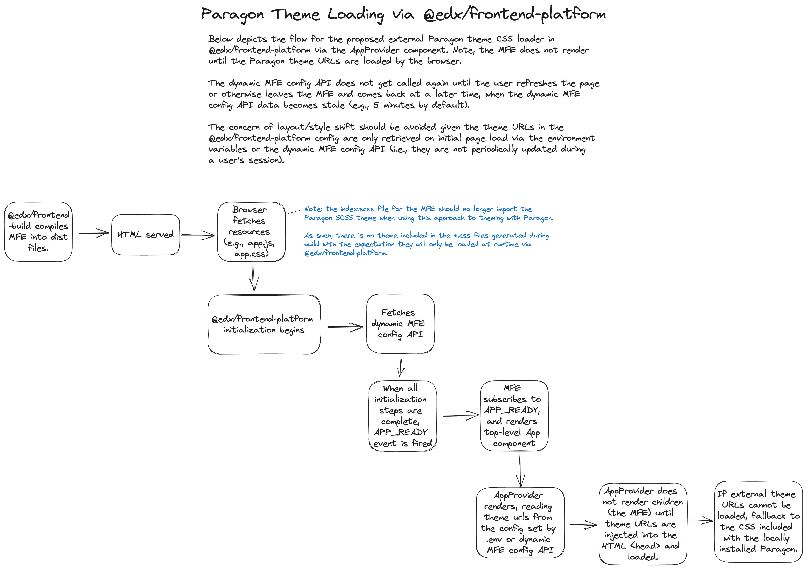

# Theming support with Paragon

This document serves as a guide to using `@edx/frontend-platform` to support MFE theming with Paragon using theme CSS loaded externally (e.g., from a CDN). By serving CSS loaded externally, consuming applications of Paragon no longer need to be responsible for compiling the theme SCSS to CSS themselves and instead use a pre-compiled CSS file. In doing so, this allows making changes to the Paragon theme without needing to necessarily re-build and re-deploy all consuming applications. We would also get a meaningful gain in performance as loading the compiled theme CSS from an external CDN means micro-frontends (MFEs) can include cached styles instead of needing to load essentially duplicate theme styles as users navigate across different MFEs.

## Overview



## Basic theme URL configuration

Paragon supports 2 mechanisms for configuring the Paragon theme URLs:
* JavaScript-based configuration via `env.config.js`.
* MFE runtime configuration API via `edx-platform`

Using either configuration mechanism, a `PARAGON_THEME_URLS` configuration setting must be created to point to the externally hosted Paragon theme CSS files, e.g.:

```json
{
    "core": {
        "url": "https://cdn.jsdelivr.net/npm/@edx/paragon@$paragonVersion/dist/core.min.css"
    },
    "variants": {
        "light": {
            "url": "https://cdn.jsdelivr.net/npm/@edx/paragon@$paragonVersion/dist/light.min.css",
            "default": true,
            "dark": false,
        }
    }
}
```

### JavaScript-based configuration

One approach to configuring the `PARAGON_THEME_URLS` is to create a `env.config.js` file in the root of the repository. The configuration is defined as a JavaScript file, which affords consumers to use more complex data types, amongst other benefits.

To use this JavaScript-based configuration approach, you may set a `PARAGON_THEME_URLS` configuration variable in a `env.config.js` file:

```js
const config = {
    PARAGON_THEME_URLS: {
        core: {
            url: 'https://cdn.jsdelivr.net/npm/@edx/paragon@$paragonVersion/dist/core.min.css',
        },
        variants: {
            light: {
                url: 'https://cdn.jsdelivr.net/npm/@edx/paragon@$paragonVersion/dist/light.min.css',
                default: true,
                dark: false,
            },
        },
    },
};

export default config;
```

### MFE runtime configuration API

`@edx/frontend-platform` additionally supports loading application configuration from the MFE runtime configuration API via `edx-platform`. The configuration is served by the `http://localhost:18000/api/mfe_config/v1` API endpoint. For more information, refer to [this documentation](https://github.com/openedx/edx-platform/blob/master/lms/djangoapps/mfe_config_api/docs/decisions/0001-mfe-config-api.rst) about the MFE runtime configuration API, please see these docs.

The application configuration may be setup via Django settings as follows:

```python
ENABLE_MFE_CONFIG_API = True
MFE_CONFIG = {}
MFE_CONFIG_OVERRIDES = {
    # The below key represented the `APP_ID` defined in your MFE
    'profile': {
        'PARAGON_THEME_URLS': {
            'core': {
                'url': 'https://cdn.jsdelivr.net/npm/@edx/paragon@$paragonVersion/dist/core.min.css',
            },
            'variants': {
                'light': {
                    'url': 'https://cdn.jsdelivr.net/npm/@edx/paragon@$paragonVersion/dist/light.min.css',
                    'default': True,
                    'dark': False,
                },
            },
        },
    },
}
```

### Locally installed `@edx/paragon`

If you would like to use the same version of the Paragon CSS URLs as the locally installed `@edx/paragon`, the configuration for the Paragon CSS URLs may contain a wildcard `$paragonVersion` which gets replaced with the locally installed version of `@edx/paragon` in the consuming application, e.g.:

```shell
https://cdn.jsdelivr.net/npm/@edx/paragon@$paragonVersion/dist/core.min.css
https://cdn.jsdelivr.net/npm/@edx/paragon@$paragonVersion/dist/light.min.css
```

In the event the other Paragon CSS URLs are configured via one of the other documented mechanisms, but they fail to load (e.g., the CDN url throws a 404), `@edx/frontend-platform` will fallback to injecting the locally installed Paragon CSS from the consuming application into the HTML document.

## Usage with `@edx/brand`

The core Paragon design tokens and styles may be optionally overriden by utilizing `@edx/brand`, which allows theme authors to customize the default Paragon theme to match the look and feel of their custom brand.

This override mechanism works by compiling the design tokens defined in `@edx/brand` with the the core Paragon tokens to generate overrides to Paragon's default CSS variables, and then compiling the output CSS with any SCSS theme customizations not possible through a design token override.

The CSS urls for `@edx/brand` overrides will be applied after the core Paragon theme urls load, thus overriding any previously set CSS variables and/or styles.

To enable `@edx/brand` overrides, the `PARAGON_THEME_URLS` setting may be configured as following:

```js
const config = {
    PARAGON_THEME_URLS: {
        core: {
            urls: {
                default: 'https://cdn.jsdelivr.net/npm/@edx/paragon@$paragonVersion/dist/core.min.css',
                brandOverride: 'https://cdn.jsdelivr.net/npm/@edx/brand-edx.org@#brandVersion/dist/core.min.css',
            },
        },
        variants: {
            light: {
                urls: {
                    default: 'https://cdn.jsdelivr.net/npm/@edx/paragon@$paragonVersion/dist/light.min.css',
                    brandOverride: 'https://cdn.jsdelivr.net/npm/@edx/brand-edx.org@$brandVersion/dist/light.min.css',
                },
                default: true,
                dark: false,
            },
        },
    },
};

export default config;
```

### Locally installed `@edx/brand`

If you would like to use the same version of the brand override CSS URLs as the locally installed `@edx/brand`, the configuration for the Paragon CSS URLs may contain a wildcard `$brandVersion` which gets replaced with the locally installed version of `@edx/brand` in the consuming application, e.g.:

```shell
https://cdn.jsdelivr.net/npm/@edx/brand@$brandVersion/dist/core.min.css
https://cdn.jsdelivr.net/npm/@edx/brand@$brandVersion/dist/light.min.css
```
